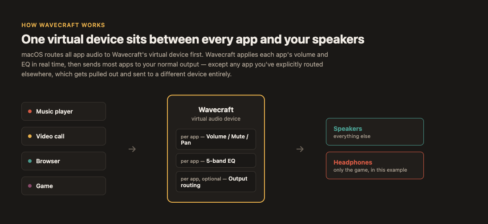
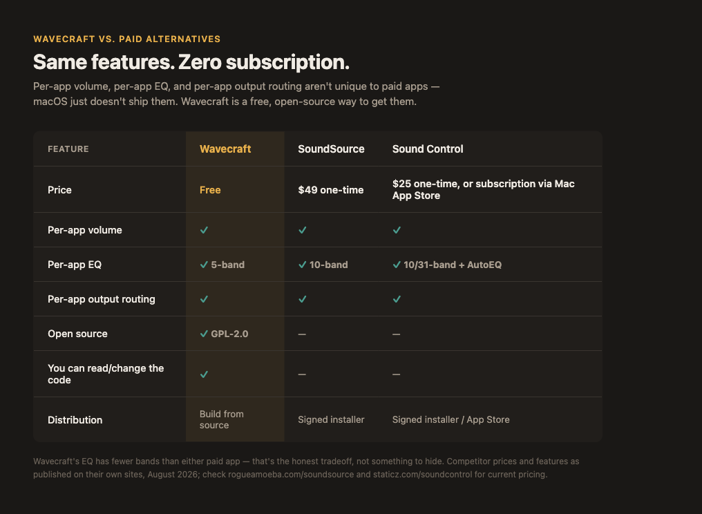

<!-- vim: set tw=120: -->


# Wavecraft
##### A free, native per-app audio mixer for macOS

Per-app volume, per-app EQ, and per-app output routing — the things SoundSource charges for — as a
CoreAudio virtual device you build yourself. No subscription, no App Store account, no license key.

Free forever, but if it's useful to you: [ko-fi.com/phaenex](https://ko-fi.com/phaenex).

[What is this](#what-is-this)<br/>
[Features](#features)<br/>
[Requirements](#requirements)<br/>
[Install (build from source)](#install-build-from-source)<br/>
[Run / Configure](#run--configure)<br/>
[Full guide](docs/GUIDE.md)<br/>
[Uninstall](#uninstall)<br/>
[Known limitations](#known-limitations)<br/>
[Troubleshooting](#troubleshooting)<br/>
[Why a fork instead of a paid app](#why-a-fork-instead-of-a-paid-app)<br/>
[Contributing](#contributing)<br/>
[Related projects](#related-projects)<br/>
[License](#license)<br/>

# What is this

**Wavecraft** is a fork of [Background Music](https://github.com/kyleneideck/BackgroundMusic) by
Kyle Neideck and contributors — a free, open-source (GPL-2.0) macOS audio utility that installs a
CoreAudio HAL virtual device so every app's output can be routed through it, remixed, and sent back
out. That's the entire reason per-app volume is possible at all on macOS: the OS has no native API
for it, so someone has to sit in the middle of the audio path.



Wavecraft adds two things on top of upstream Background Music:

- **Per-app EQ** — a 5-band equalizer per application, not just a volume slider.
- **Per-app output routing** — send one app's audio to your headphones while everything else stays
  on your speakers, via [CoreAudio Process Taps](docs/PROCESS-TAP-ROUTING.md) rather than the
  single shared virtual device upstream's architecture is built around.

Everything else — auto-pause, per-app volume/pan/mute, recording system audio — is upstream
Background Music, unchanged.

# Features

- **Per-app volume** — a volume slider for every running app, independent of the system volume.
  You can boost quiet apps above their normal maximum.
- **Per-app EQ** *(new in Wavecraft)* — 5 bands per app (60Hz / 250Hz / 1kHz / 4kHz / 12kHz, ±12dB
  each), applied in real time in the driver.
- **Per-app output routing** *(new in Wavecraft)* — pick a different physical output device for an
  individual app's audio, independent of your system's default output.
- **Auto-pause music** — pauses your music player when another app starts playing audio, and
  unpauses it when that audio stops. Supports iTunes/Music, Spotify, VLC, VOX, Decibel, Hermes,
  Swinsian, and GPMDP.
- **Record system audio** — with Wavecraft running, select it as the input device in QuickTime
  Player (**File > New Audio Recording**) to record whatever your Mac is playing. You can combine
  it with a microphone using an [aggregate device](https://support.apple.com/en-us/HT202000) in
  **Audio MIDI Setup**.
- **No restart required to install.**

# Requirements

**macOS 10.13+** for the base app (per-app volume, auto-pause, recording).

**macOS 26.0+** for per-app output routing specifically — it's built on
[`CATapDescription.processRestoreEnabled`](docs/PROCESS-TAP-ROUTING.md), which doesn't exist on
older systems. On an older macOS, everything else works normally; routing just isn't available.

Per-app EQ has no extra requirement beyond the base app.

# Install (build from source)

There's no signed release build — no download, no Homebrew cask, no `.pkg`. Building from source is
the point — the *only* reason this fork exists is that [upstream's official release binary runs
under Rosetta on Apple Silicon](https://github.com/kyleneideck/BackgroundMusic/issues/395), and
building it yourself with a current Xcode produces a native `arm64` build instead. It usually takes
under a minute, and doesn't need any macOS restart.

**Requires [Xcode](https://apps.apple.com/us/app/xcode/id497799835) (not just the Command Line
Tools) — the driver target needs the full Xcode toolchain.**

### Option 1 — one command

Open **Terminal** and paste this in:

```shell
(set -eo pipefail; URL='https://github.com/Phaenex/wavecraft/archive/main.tar.gz'; \
    cd $(mktemp -d); echo Downloading $URL to $(pwd); curl -qfL# $URL | gzcat - | tar x && \
    /bin/bash wavecraft-main/build_and_install.sh && rm -rf wavecraft-main)
```

<details><summary>More info...</summary>

This downloads a tarball of the repo to a temporary directory, builds it, installs it, and cleans
up after itself. It uses `/bin/bash` instead of `bash` in case you have a nonstandard Bash in your
`$PATH`. It uses `gzcat - | tar x` instead of `tar xz` because `gzcat` also checks the download's
integrity (gzip files include a checksum), so a half-downloaded archive won't silently run a broken
script.

</details>

### Option 2 — clone it yourself

```shell
git clone https://github.com/Phaenex/wavecraft.git
cd wavecraft
./build_and_install.sh
```

Either way, `build_and_install.sh` builds all three components (the driver, the XPC helper, and the
menu bar app), installs the driver to `/Library/Audio/Plug-Ins/HAL/`, and restarts `coreaudiod`. It
needs `sudo` — macOS only loads CoreAudio HAL drivers from that one system-owned path, so there's no
way around installing as root. Audio will glitch briefly while `coreaudiod` restarts, so pause
anything that's playing first.

For a manual, step-by-step build (no install script), see
[MANUAL-INSTALL.md](MANUAL-INSTALL.md). If something goes wrong, check
[docs/TROUBLESHOOTING.md](docs/TROUBLESHOOTING.md) first — it's a running log of build/install
problems that actually happened while developing this fork, with the real fix for each.

# Run / Configure

Run `Applications > Wavecraft.app` (the built app bundle is still internally named "Background
Music.app" — none of the underlying Xcode targets, bundle identifiers, or launchd labels were
renamed, only this fork's own branding and docs). It sets itself as your system's default output
device on launch and puts an icon in the menu bar — click it for volume/EQ/routing controls per
app, and it reverts your default output device on quit.

Once installed, each app's row in the menu also has EQ sliders and an output-device picker under
its "show more controls" arrow, alongside the existing volume and pan controls. See
[docs/GUIDE.md](docs/GUIDE.md) for a full walkthrough of every control in the menu.

### Launch at Startup (optional)

Add it to **System Settings > General > Login Items**.

# Uninstall

```shell
cd /Applications/Background\ Music.app/Contents/Resources/
bash uninstall.sh
```

For a manual uninstall, see [MANUAL-UNINSTALL.md](MANUAL-UNINSTALL.md).

# Known limitations

Inherited from upstream, not introduced by this fork:

- Only 2-channel (stereo) output devices are supported as the *main* output device. An 8-channel
  monitor caused a "severe choppiness" report that looked like an OS regression but was actually
  this — check **Audio MIDI Setup** for your output device's channel count before assuming
  something else is broken.
- Setting an app's volume above 50% can clip. Keep your main output near max and lower individual
  apps instead of boosting them.
- First run needs "Microphone" permission in System Settings for the virtual input device — it
  doesn't actually listen to your microphone; macOS just classifies Wavecraft's input side that way
  because it's a virtual audio input.
- **Because of that, the orange "microphone in use" pill shows in your menu bar the whole time
  Wavecraft is running.** This isn't Wavecraft's icon and isn't something the app can turn off —
  it's macOS's own system-wide privacy indicator (since Monterey), and it does this for *any*
  virtual/loopback audio device, including BlackHole and Loopback, not just this one. The only
  control over it is system-wide: **System Settings > Privacy & Security > Microphone > Privacy
  Indicators**, which also affects the indicator for apps using a real microphone — there's no way
  to exempt one specific device.

Specific to this fork's new features:

- Per-app output routing needs macOS 26.0+ (see [Requirements](#requirements)).
- Routing assignments are held in the menu bar app's own process, not the driver (a deliberate
  design choice — see [docs/PROCESS-TAP-ROUTING.md](docs/PROCESS-TAP-ROUTING.md)), so they don't
  survive the app itself restarting the way per-app volume does. They *do* survive the routed app
  being quit and reopened.

# Troubleshooting

See [docs/TROUBLESHOOTING.md](docs/TROUBLESHOOTING.md) for build/install issues, and
[docs/LESSONS.md](docs/LESSONS.md) for the less obvious things that came up while developing this
fork (an "open Tahoe bug" that turned out to be the 2-channel limitation above, a build-vs-test
sandbox permission gotcha, etc.).

If Wavecraft crashes and your audio stops working, open **System Settings > Sound** and change your
default output device to something other than the Wavecraft device — if it's already something
else, switch away and back again.

If a volume slider isn't working for an app, check **More Apps** for entries like `Some App
(Helper)` — some meeting/video apps route audio through a helper process you need to control
instead.

# Why a fork instead of a paid app

We tried [SoundSource](https://rogueamoeba.com/soundsource/) first. It's a good app, but per-app
volume, EQ, and output routing are things the operating system should let you do without paying a
subscription for a feature the hardware and OS already support — Background Music does the same
core job for $0 and is GPL-2.0, it just needed a native Apple Silicon build and a couple of the
features SoundSource charges for.



Wavecraft's EQ has fewer bands than either paid app — that's the honest tradeoff of a smaller,
volunteer-built project, not something to hide. Feature parity (more EQ bands, AutoEQ, etc.) is on
the roadmap; see [TODO.md](TODO.md).

# Contributing

See [CONTRIBUTING.md](CONTRIBUTING.md).

# Related projects

- [Background Music](https://github.com/kyleneideck/BackgroundMusic) — the upstream project this
  is forked from. If your issue isn't specific to per-app EQ, output routing, or the native build,
  it's probably worth checking there too.
- [Core Audio User-Space Driver
  Examples](https://developer.apple.com/library/mac/samplecode/AudioDriverExamples/Introduction/Intro.html) —
  the Apple sample code the driver is based on.
- [Soundflower](https://github.com/mattingalls/Soundflower) — a virtual audio device for passing
  audio between apps.
- [BlackHole](https://github.com/ExistentialAudio/BlackHole) — a modern virtual audio driver with
  zero added latency.
- [eqMac](https://github.com/nodeful/eqMac2) — system-wide audio equalizer for the Mac.
- [Sound Pusher](https://github.com/q-p/SoundPusher) — virtual audio device, real-time encoder and
  S/PDIF forwarder.

### Non-free

- [Audio Hijack](https://rogueamoeba.com/audiohijack/),
  [SoundSource](https://rogueamoeba.com/soundsource/) — the apps this project exists to be a free
  alternative to.
- [Sound Siphon](https://staticz.com/soundsiphon/),
  [Sound Control](https://staticz.com/soundcontrol/) — per-app volumes and a system EQ.
- [Boom 2](https://www.globaldelight.com/boom/) — volume booster and equalizer.

## License

Wavecraft is a fork of [Background Music](https://github.com/kyleneideck/BackgroundMusic),
copyright © 2016-2026 [Background Music
contributors](https://github.com/kyleneideck/BackgroundMusic/graphs/contributors), with changes
copyright © 2026 Wavecraft contributors. Licensed under
[GPLv2](https://www.gnu.org/licenses/gpl-2.0.html), or any later version — see [LICENSE](LICENSE).

Also includes code from:

- [Core Audio User-Space Driver
  Examples](https://developer.apple.com/library/mac/samplecode/AudioDriverExamples/Introduction/Intro.html),
  [original license](LICENSE-Apple-Sample-Code), Copyright (C) 2013 Apple Inc. All Rights Reserved.
- [Core Audio Utility
  Classes](https://developer.apple.com/library/content/samplecode/CoreAudioUtilityClasses/Introduction/Intro.html),
  [original license](LICENSE-Apple-Sample-Code), Copyright (C) 2014 Apple Inc. All Rights Reserved.
